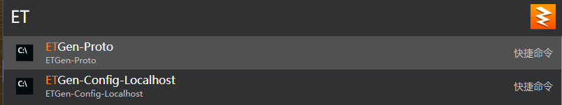
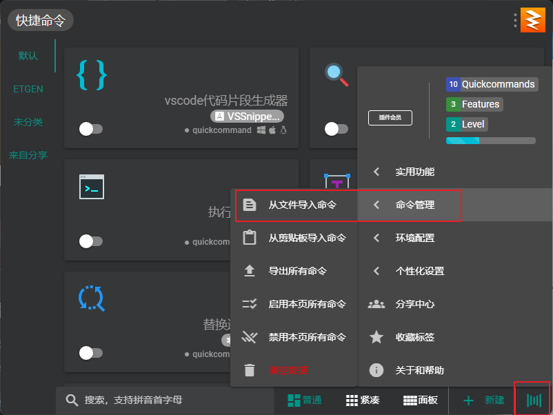
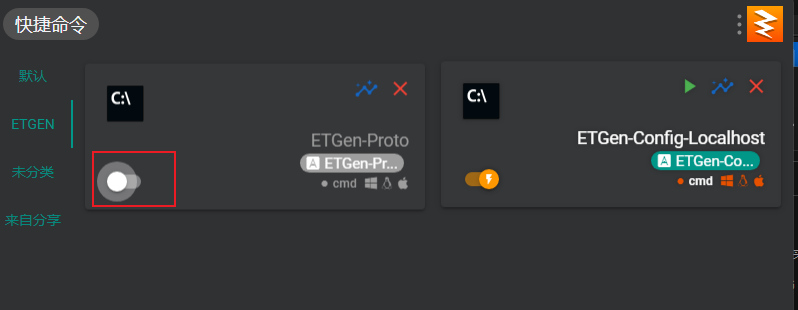
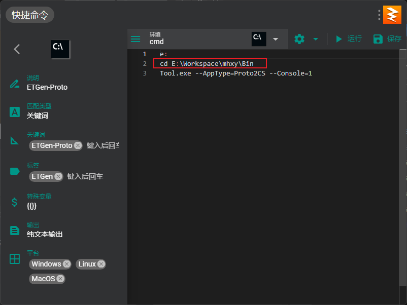
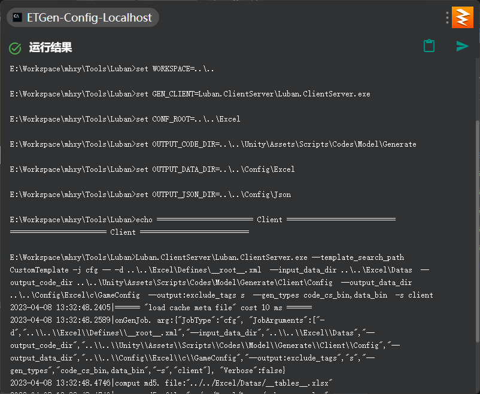

## uTools说明

uTools是一个跨平台的快捷启动工具，里面集成了本地文件启动、Everything等功能。

我们可以借助uTools的`快捷命令`插件来实现调用指定程序、批处理文件的功能，这样就不用在修改配置表、修改proto后，各个窗口切来切去执行生成命令了，只需要简单的`Alt+Space`输入`ET`就可以执行对应的生成指令

## 安装流程

1. 在官网下载并安装uTools， [https://u.tools/](https://u.tools/)

2. 通过`Alt+Space`唤起uTools，输入`插件应用市场`，按下回车，在左侧输入`快捷命令`，然后安装这个插件

   

3. 再通过Alt+Space唤起uTools，输入`快捷命令`，打开该插件的设置界面，通过右下角的菜单键打开并找到`从文件导入命令`菜单项

   

4. 将`快捷命令分享`文件夹下的文件依次导入，并将命令设置为激活状态

   

5. 点击进入命令的设置，修改每个命令第二行的项目路径地址成你自己电脑上项目路径的地址后点击保存按钮即可。

   

6. 使用效果如下:

   